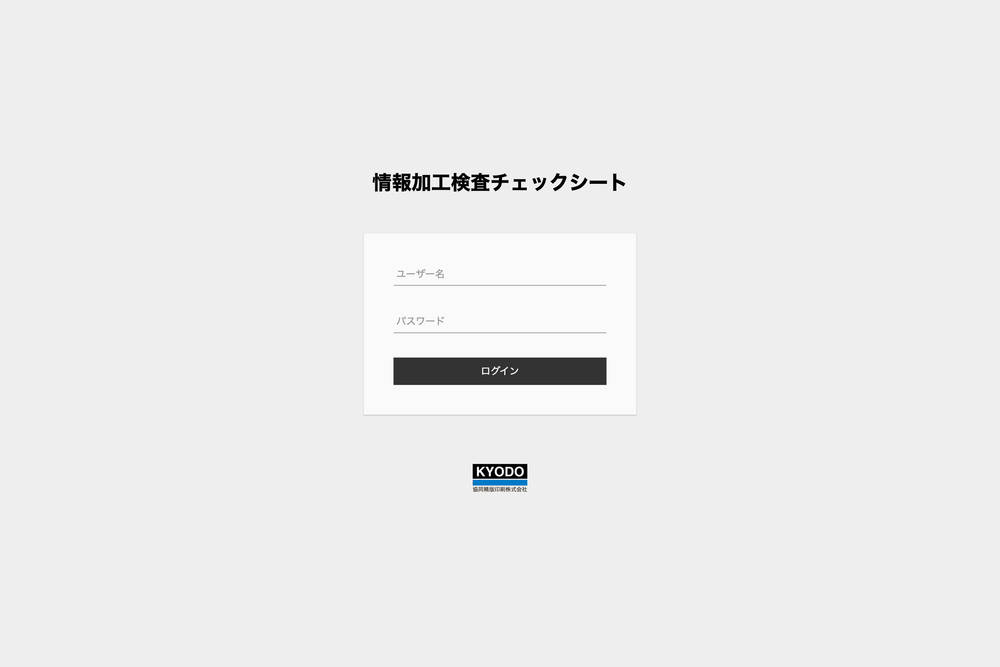
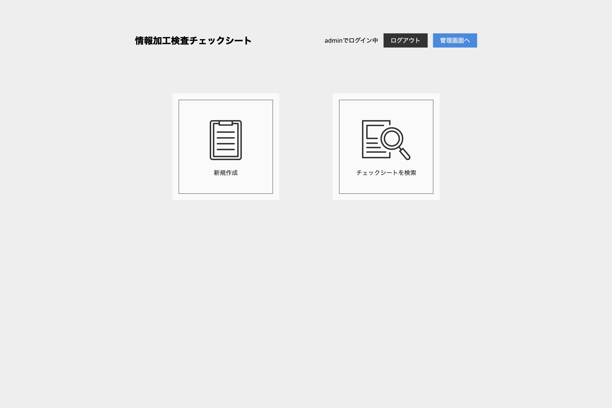
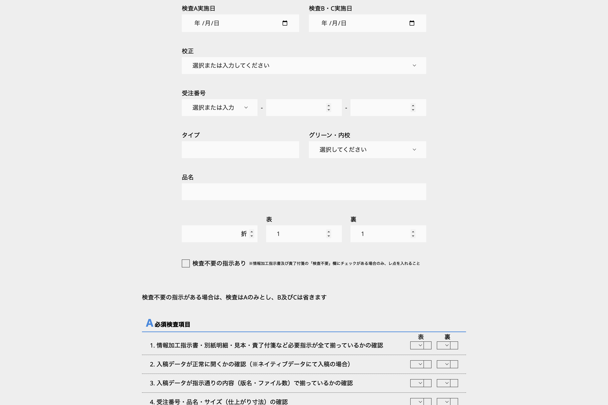
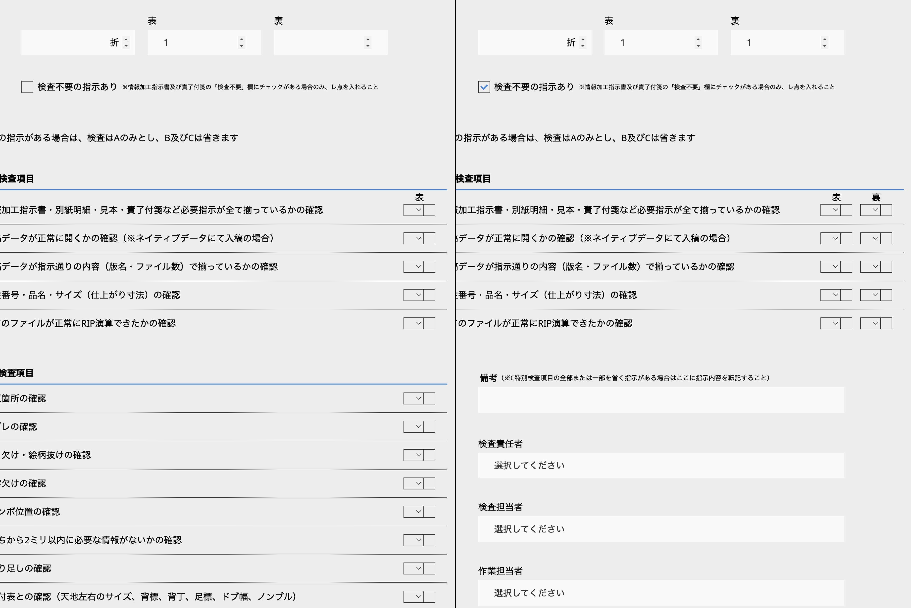
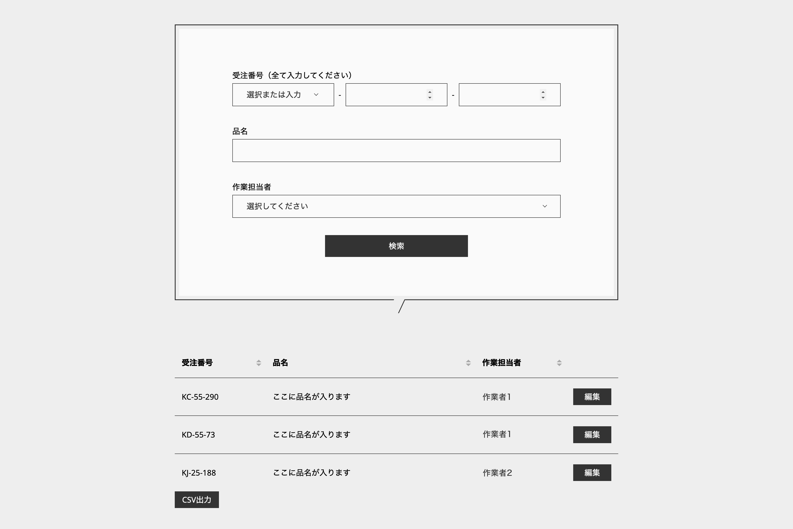
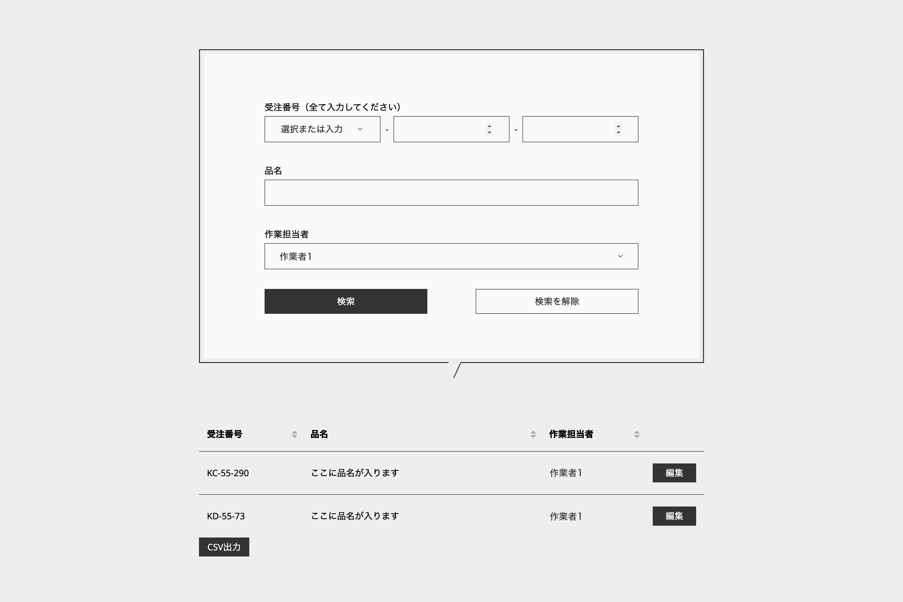
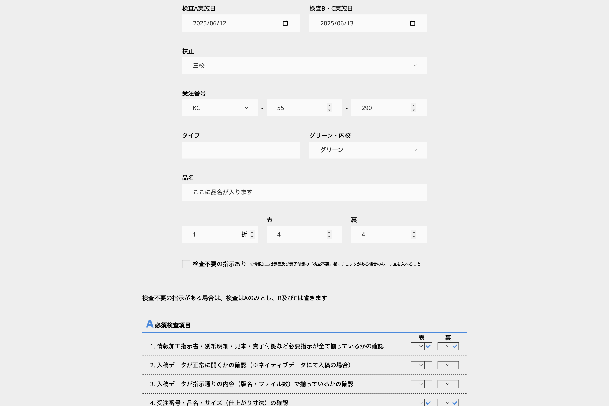
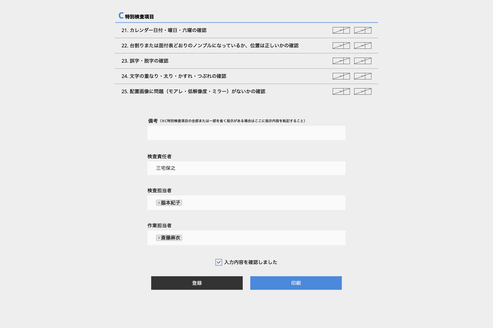
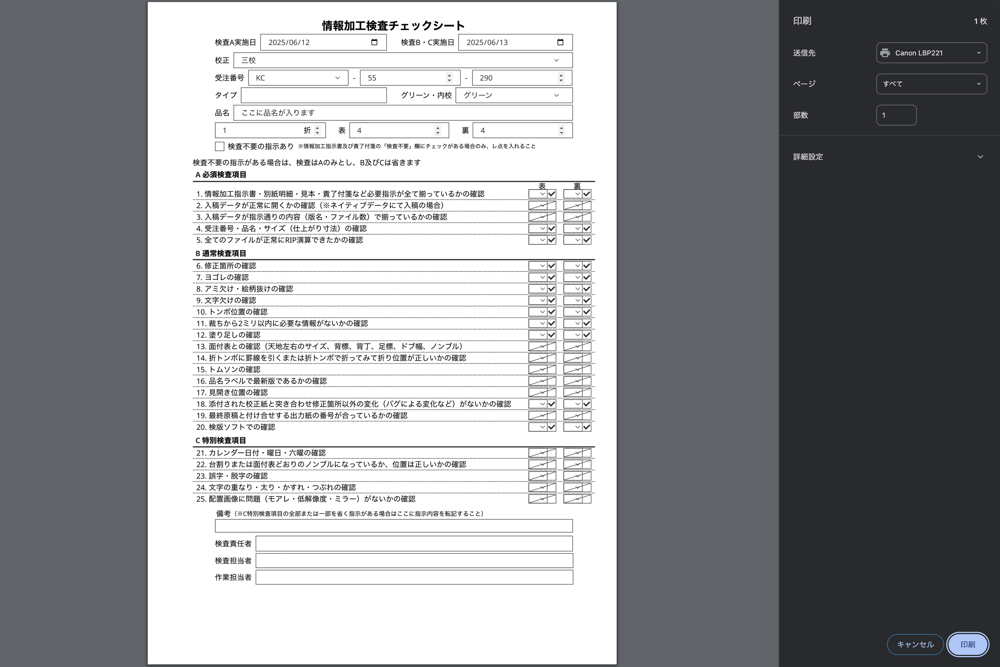
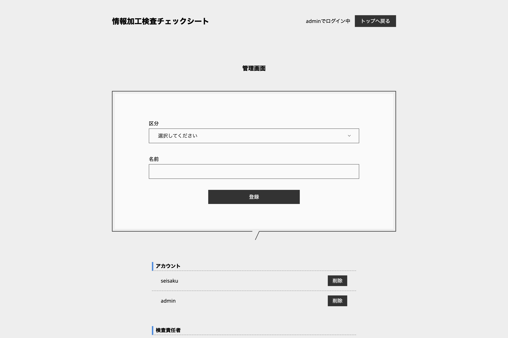

## 🌸 プロジェクト名
情報加工検査チェックシート

---

## 📝 概要
印刷業務の工程の一つである「検版作業」（印刷物として仕上がる前に、
デザイン・文字・色・レイアウトなどに誤りがないかを確認する工程）で使用しているチェックシートをデジタル化しました。  
従来は紙で管理していましたが、Web上で閲覧・入力・出力できる形式に変更し、業務効率の向上を図りました。

---

## 🎯 開発の目的
紙のチェックシートでは、作業者が手書きで記入しており、1つの印刷案件でもお客様からの再校・三校などの修正対応が入るたびに、
新しいチェックシートを作成し、品名や検査内容を最初から書き直す必要がありました。  
また、チェックシート用の紙代や印刷コスト、さらに一定期間の保管スペースの確保にも課題がありました。  
こうした問題を解決するため、業務効率化とコスト削減を目的としてデジタル化を実施しました。

---

## ⚙️ 使用技術
| カテゴリ | 技術 |
|-----------|------|
| フロントエンド | HTML / CSS / JavaScript  |
| バックエンド | PHP |
| データベース | MySQL |
| 開発環境 | MAMP / VSCode / GitHub |

---

## 💡 工夫したポイント
- 現場作業者の運用しやすさを意識してUI設計を実施しました  
- 入力内容に応じてチェック項目が変化するため、jQueryを用いた動的な表示切り替えを実装し、記入ミスを削減しました  
- データ登録や編集機能では、正確な処理を行うために試行錯誤を重ねました  
- チームメンバーによる運用テストを重ね、現場の声を反映しながら改善を繰り返すことで実用性を高めました  
- セッションハイジャックやクリックジャッキング対策を実施し、セキュリティ面にも配慮しました  

---

## 🖥️ 機能一覧
<table>
  <tr>
    <th width="600">ログイン画面</th>
    <th width="600">メニュー画面</th>
  </tr>
  <tr>
    <td></td>
    <td></td>
  </tr>
  <tr>
    <td>ログインIDとパスワードでの認証機能を実装しました。 ログインの仕様にはセッションを利用しアクセス制御を行っています。</td>
    <td>誰でも使いやすいようにシンプルなデザインにしました。</td>
  </tr>
  <tr>
    <th colspan="2">新規登録画面</th>
  </tr>
  <tr>
    <td></td>
    <td></td>
  </tr>
  <tr>
    <td>チェックシートを新規登録できます。 内容は紙ベースのままデザインを改良しました。</td>
    <td>上部フォームの入力内容によってチェックが不要な所は動的に非表示になり作業者の誤入力を防ぎます。</td>
  </tr>
  <tr>
    <th colspan="2">検索画面</th>
  </tr>
  <tr>
    <td></td>
    <td></td>
  </tr>
  <tr>
    <td>過去に登録したチェックシートが全て表示されます。 項目ごとに昇順降順と並び替え機能も実装しました。</td>
    <td>過去に登録したチェックシートを検索・編集することができます。</td>
  </tr>
  <tr>
    <th colspan="2">編集画面</th>
  </tr>
  <tr>
    <td></td>
    <td></td>
  </tr>
  <tr>
    <td>登録済みのチェックシートの編集ができます。 工程を進める際の作業者の引き継ぎが簡単になりました。</td>
    <td>確認チェックを入れると、上部フォームがロックされ、誤操作を防ぐ仕組みになっています。</td>
  </tr>
  <tr>
    <th>出力画面</th>
    <th>管理画面</th>
  </tr>
  <tr>
    <td></td>
    <td></td>
  </tr>
  <tr>
    <td>入力内容の出力機能を実装しました。 コピー出力しても用紙に全ての内容が収まるよう調整しました。</td>
    <td>決められたアカウントのみ表示できるページです。 ログインアカウントやチェックシートで入力する作業者を登録・削除できます。</td>
  </tr>
</table>

---

## 📂 ディレクトリ構成
project/  
├── checkseat.php  
├── control.php  
├── delete.php  
├── edit.php  
├── index.php  
├── login.php  
├── search.php  
├── send.php  
├── update.php  
├── assets/  
│ ├── css/  
│ ├── img/  
│ └── js/  
└── dbconnect.php

---

## 👩‍💻 開発の振り返り
初めての業務システム開発として、フロント〜バックまで一通り構築を経験しました。  
PHPやデータベースの知識がほとんどない状態からのスタートでしたが、学習を進め、試行錯誤しながら完成までやり遂げた経験が大きな成長につながりました。
